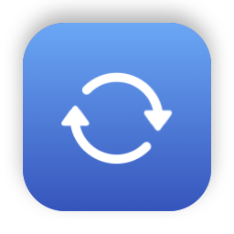

<p align="center">
  
</p>

# Cyclist

A keyboard-driven app switcher for macOS. No thumbnails, no window screenshots - just a list of app icons, names, and window titles you cycle through with Cmd+Tab.

> **Beta.** Cyclist is in early development (0.x). Expect rough edges and breaking changes between releases.

<p align="center">
  
</p>

## What it does

- Replaces the native Cmd+Tab switcher with a vertical, text-only list in most-recently-used app order. Every window gets its own row (`App - Window title`), so two Safari windows are two entries, and within an app the rows are ordered by when you last used each window.
- A quick Cmd+Tab tap returns to the previous window, wherever it lives - even between two windows of the same app, and even across Spaces or workspaces.
- Windows in other Spaces (including native fullscreen) get their own rows too. With Screen Recording permission granted their titles are live; without it, each row shows the last title Cyclist saw while that window was visible. Selecting a row jumps straight to that Space.
- A separate binding (Cmd+`) cycles through the windows of the frontmost app in most-recently-used order, including minimized ones and windows in other Spaces (native fullscreen included) - things the native window cycler skips. A quick tap bounces between the app's last two windows.
- Ctrl+Left/Right walks the native Spaces of the active display (the one holding the menu bar) in Mission Control order - user desktops and fullscreen Spaces alike - instantly and without animation. Arriving on a desktop focuses its top window, so leaving a fullscreen app always lands somewhere concrete.
- The trackpad's Spaces swipe (three or four fingers, per System Settings > Trackpad > More Gestures) drives that same navigation: Cyclist intercepts the gesture before the Dock sees it and steps instantly instead of playing the animated transition. The system gesture must stay **enabled** - it is what makes macOS emit the gesture events at all. A Settings toggle ("Trackpad swipe navigation") hands the gesture back to macOS at any time.
- With [AeroSpace](https://github.com/nikitabobko/AeroSpace) running, its workspaces join that ring in place of the desktop hosting them, so Ctrl+Left/Right walks `workspace 1 ... workspace N, fullscreen Spaces` seamlessly - workspace steps go over AeroSpace's socket, and crossing from a fullscreen Space lands on the ring-adjacent workspace. Windows parked in hidden workspaces appear in the switcher as `workspace N` rows; selecting one switches there. A workspace whose windows all went native-fullscreen is hollow - its windows display on their own Spaces and visiting it shows a bare desktop - so the ring skips it by default and the fullscreen Space itself is the stop; `show-hollow-workspaces = true` in the config file restores those stops. The integration is opt-in (`integration = true` under `[aerospace]` in the config file) and everything falls back to plain native behavior the moment AeroSpace is absent or disabled.
- Four independent settings control what shows up in the list:
  - include **hidden** apps (Cmd+H)
  - include **minimized** apps (all windows in the Dock)
  - include apps whose windows live in **other Spaces** (including native fullscreen)
  - include running apps with **no windows** at all (off by default; selecting one behaves like clicking its Dock icon, so the app reopens a window)

## Keybindings

The four global shortcuts below are the defaults - rebind them in Settings (click the shortcut, press the new keys) or in the config file's `[shortcuts]` section.

Global - work anytime:

| Keys                | Action                                        |
| ------------------- | --------------------------------------------- |
| Cmd+Tab (quick tap) | Switch to the previous window (any app)       |
| Cmd+Tab (hold Cmd)  | Open the switcher list (Shift reverses)       |
| Cmd+`               | Cycle windows of the frontmost app            |
| Ctrl+Left / Right   | Previous / next workspace or fullscreen Space |
| Trackpad swipe      | Previous / next workspace or fullscreen Space |

While the switcher is open (Cmd held):

| Keys            | Action                          |
| --------------- | ------------------------------- |
| Tab / Shift+Tab | Advance / reverse the selection |
| Up/Down, K/J    | Move the selection              |
| Q               | Quit the selected app           |
| W               | Close the selected window       |
| , (Cmd+,)       | Open the Settings window        |
| Esc             | Cancel                          |
| Release Cmd     | Switch to the selected item     |

Quit and Close keep the list open: the affected rows leave and the selection moves to a neighbor.

## Requirements

- macOS 26 (Tahoe)
- **Accessibility** permission (System Settings > Privacy & Security > Accessibility) - required for the global Cmd+Tab hook and for reading window state
- **Screen Recording** permission, optional but recommended - macOS gates the titles of windows in other Spaces behind it. Cyclist uses it only to read those titles; without it, other-Space rows show the last title Cyclist saw

## Install

### Homebrew

```sh
brew install --cask pszypowicz/tap/cyclist
```

The cask clears the quarantine flag (release builds are not notarized yet) and launches the app after install.

### Build from source

```sh
scripts/build-app.sh
cp -R build/Cyclist.app /Applications/
open /Applications/Cyclist.app
```

The build script signs with your "Apple Development" certificate when one is present so the Accessibility grant survives rebuilds. See `scripts/build-app.sh --help` for options.

On first launch Cyclist prompts for Accessibility permission and activates itself once granted. It lives in the menu bar (no Dock icon); the menu holds an Enabled switch (turns every hook off, the icon dims, and the native shortcuts work again immediately), Settings, About, and Quit. The Settings window holds the list options, trackpad swipe navigation, and a native Launch at Login toggle (registers with System Settings > General > Login Items).

## Configuration

The Settings window covers all switches. The AeroSpace-related ones (the window's advanced section) are stored in a config file rather than app defaults, where dotfiles can own them:

```
${XDG_CONFIG_HOME:-~/.config}/cyclist/cyclist.toml
```

```toml
[shortcuts]
# Modifiers and a key joined with "+": cmd, alt, ctrl, shift plus a key
# name (tab, backtick, left, right, up, down, space, return, a letter,
# a digit, ...). Defaults below.
switcher = "cmd+tab"
cycle-windows = "cmd+backtick"
previous-space = "ctrl+left"
next-space = "ctrl+right"

[aerospace]
# The AeroSpace bridge (socket client). Default: false.
integration = true

# Keep chain stops for workspaces whose windows all went native-fullscreen.
# Default: false.
show-hollow-workspaces = false
```

- The accepted grammar is a TOML subset: `[section]` headers, `key = true|false` and `key = "string"` lines, and `#` comments. Unreadable lines and unknown keys are logged and skipped.
- A missing file is created from a commented template (the example above) on first launch; a missing key means its default. Beyond that, Cyclist writes the file only when an AeroSpace switch is flipped in Settings, as a single-line edit: comments, formatting, and symlinked (stow-managed) files survive.
- Edits apply live.
- `XDG_CONFIG_HOME` is honored when the app's environment carries it (absolute paths only, per the XDG spec). GUI launches usually don't - launchd provides the environment, not the shell - so `~/.config` is the effective location.

## Known limitations

- Cyclist consumes the Previous/Next Space shortcuts (Ctrl+Left/Right by default) for chain navigation; disable the equivalent Mission Control shortcuts if you do not want both meanings, or turn off "Keyboard Space navigation" in Settings. The menu's Enabled switch (or quitting Cyclist) brings the native behavior back.
- Cyclist also consumes the trackpad Spaces-swipe gesture while "Trackpad swipe navigation" is on; flip the Settings toggle to get the native animated swipe back without quitting. One swipe is one step - a long swipe does not scrub across several Spaces.
- While a password field has secure input enabled, macOS withholds keystrokes from event taps, so Cmd+Tab temporarily falls through to the native switcher.
- Same-app window rows for other Spaces rely on the window-server list; their titles need Screen Recording permission or a previous sighting of the window (same rule as the app switcher's other-Space rows).
- The AeroSpace bridge speaks the server's socket protocol (version 1) and tracks the workspaces of AeroSpace's focused monitor. With several native desktops the ring only expands the current one.
- The list is keyboard-only; the panel ignores mouse clicks.
- Recording a shortcut needs Cyclist enabled - the recorder captures through the same event tap the shortcuts use.

## Acknowledgements

Cyclist relies on techniques that other projects worked out first:

- **Near-instant cross-Space jumps** (Ctrl+Left/Right and jumping to another Space's window) post the synthetic Dock-swipe gesture encoding from [Space Rabbit](https://github.com/Tahul/space-rabbit) - the same approach seen in InstantSpaceSwitcher and Spaceman. macOS performs no Space transition for a plain app activation, so the switch is driven by posting the gesture a trackpad would.
- **Window and focus detection** follows [AltTab](https://github.com/lwouis/alt-tab-macos) and [yabai](https://github.com/koekeishiya/yabai): reading focus changes, Space membership, and real-window state from the WindowServer's own notification stream and window records instead of the Accessibility API, and the tag/attribute predicate that filters out a fullscreen Space's companion windows.
- **The AeroSpace bridge** talks directly to [AeroSpace](https://github.com/nikitabobko/AeroSpace)'s socket.
